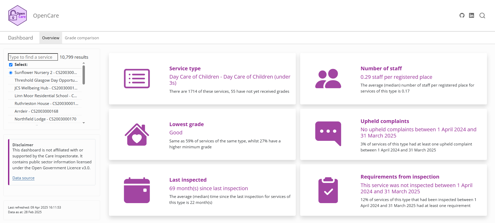

## OpenCare - compare social care across Scotland 

Search for a care service by name, and see how it’s quality compares
with its peers across Scotland using public data from the [Care
Inspectorate](https://www.careinspectorate.com/index.php/publications-statistics/44-public/93-datastore).

The dashboard can be accessed [here](https://samhendersonpalmer.github.io/OpenCareDashboard/).

## Preview

## Notes

This dashboard is not affiliated with or supported by the Care
Inspectorate. It contains public sector information licensed under the
Open Government Licence v3.0.
